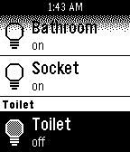

# ZWay Time
ZWay Time for Pebble - wearable client for RaZberry

ZWay Time application allows you to control your RaZberry based smart home. 
Devices are grouped into locations.

# Supported Pebble platforms:

Basalt (Pebble Time, Pebble Time Steel)

 
Aplite (original Pebble)

# Not supported Pebble platforms:

Chalk (I don't have Pebble Round to test, will add support later)

# Supported phone platforms:
* iOS (tested on iPhone 6);
* Android (tested on HTC One M8).

# Supported z-wave device types:
* on-off switches;
* motion sensors;
* humidity sensors;
* light sensors;
* temperature sensors. 

That is all I actually have =)

# Feedback
Do not hesitate to email me to add support of new device types.
sionyx.ru+pebble ﹫ gmail.com
